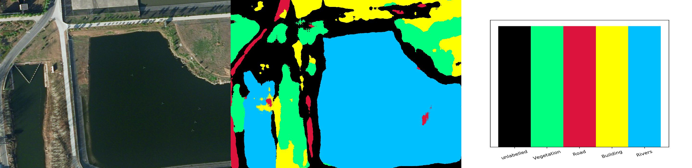

# FCN遥感影像分类 and Unet
### Unet分割结果 最新 

### 最新分割结果 FCN8s

### 之前的结果 FCN8s

#### 介绍
        此仓库不经有FCN8s的源码，且有简单的原理解释原理解释。还有Unet的实现，以及结果。
        后期可能会推出SegNet的结构

#### 软件架构
        1.本仓库当前只有FCN全卷积网络的结构。后期会推出Unet和SegNet以及其原理。

        2.本仓库基于Pytorch环境，可以不装GPU版本的pytorch

        3.在jupter notebook中运行并显示结果

#### 文件夹介绍
        1.  dataset   后面我会放上遥感影像数据集的下载地址，以及数据集的使用介绍
        
        2.  img       可以忽略，这是本文的md文件中应用到的图片。
        
        3.  FCN8s     全卷积网络结构的实现，其中包括 网络结构的实现、遥感数据集的导入、训练以及模型保存、预测单张遥感卫星图片。
        
        4.  Unet      后期会推出Unet的实现
        
        5.  论文       这个是相关论文，其中包括本仓库作者的论文，后期会奉上。
        
        6.  原理必看   这里是全卷积神经网络中softmax层以及交叉熵损失的计算，以及全卷积预测的原理。

